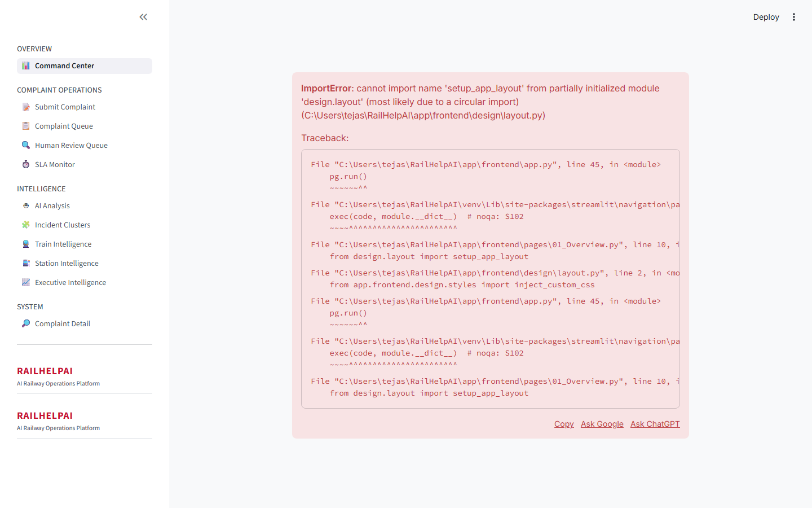
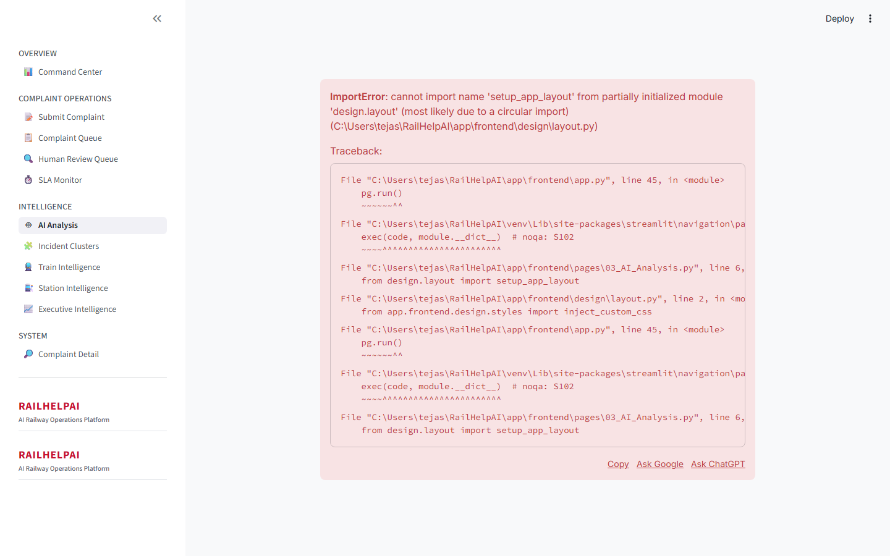
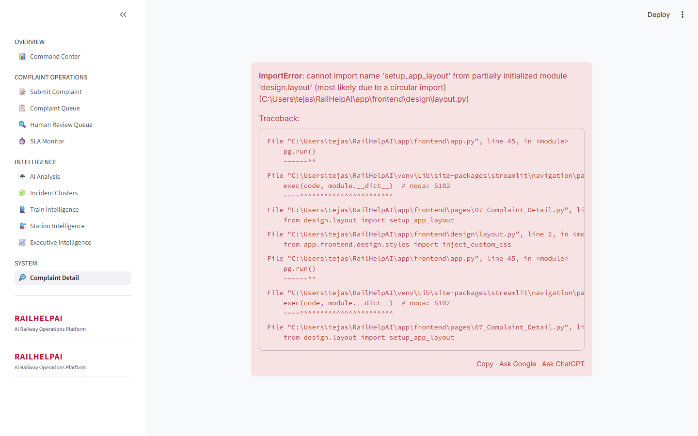
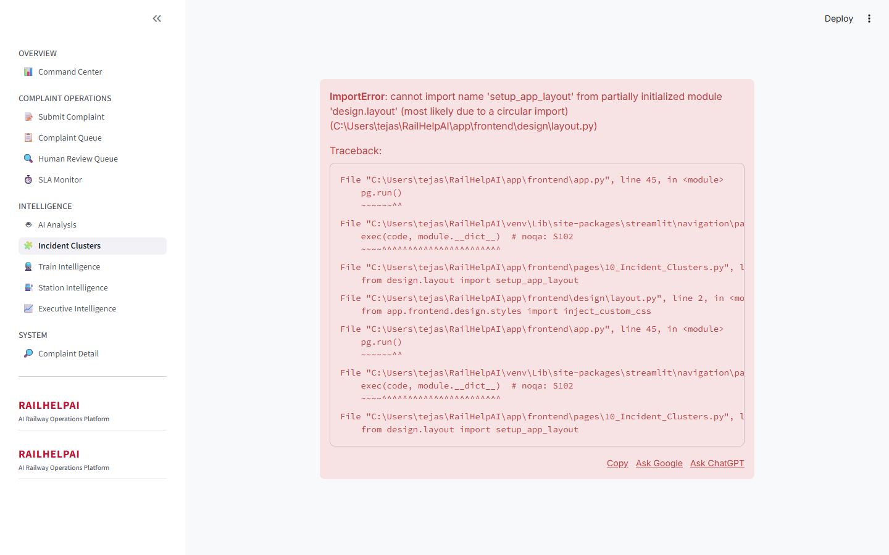
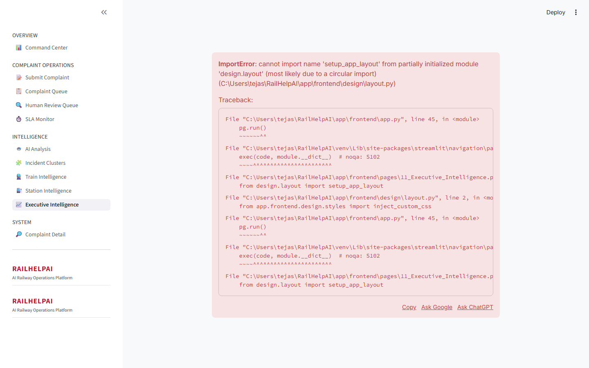

# 🚆 RailHelpAI — AI-Powered Railway Complaint Intelligence & Operations Platform

[](https://www.python.org/)
[](https://fastapi.tiangolo.com/)
[](https://streamlit.io/)
[](https://scikit-learn.org/)
[](docs/TESTING.md)
[](LICENSE)

An independent, production-inspired portfolio project that transforms raw railway passenger grievances into structured, actionable operational intelligence using NLP, machine learning, multimodal evidence analysis, workflow automation, and human-in-the-loop review.

> ⚠️ **Disclaimer:** RailHelpAI is an independent portfolio project and is not affiliated with, endorsed by, or deployed by Indian Railways. Built using a 10,000 synthetic complaint dataset for demonstration purposes.

---

## 📌 Quick Navigation

- [The Problem](#-the-problem)
- [The Solution](#-the-solution)
- [System Architecture](#-system-architecture)
- [Key Capabilities](#-key-capabilities)
- [AI Pipeline & Human-in-the-Loop](#-ai-pipeline--human-in-the-loop)
- [Empirical Results & Benchmarks](#-empirical-results--benchmarks)
- [UI/UX Operations Workstations](#-uiux-operations-workstations)
- [Product Showcase Screenshots](#-product-showcase-screenshots)
- [Security & Reliability](#-security--reliability)
- [Project Demo](#-project-demo)
- [Quick Start Guide](#-quick-start-guide)
- [Known Limitations & Roadmap](#-known-limitations--roadmap)
- [Documentation Index](#-documentation-index)

---

## 🎯 The Problem

Passenger railways process thousands of grievances daily across coaches, stations, catering services, electrical fixtures, and safety emergencies. Traditional grievance redressal systems suffer from manual routing delays, priority ambiguity, unmonitored SLA breaches, duplicate incident reports, and a lack of real-time operational risk visibility.

Without automated triage and intelligent routing, critical safety or medical emergencies can be buried under routine cleanliness complaints, leading to delayed response times and lower passenger satisfaction.

---

## 💡 The Solution

**RailHelpAI** bridges passenger grievances and railway operations by providing an end-to-end intelligence pipeline:

```mermaid
flowchart TD
    A[Passenger Grievance\nText / Image / OCR] --> B[Multilingual Normalizer\nEnglish / Hinglish / Hindi]
    B --> C[AI Classification & Entity Extractor\nCategory, Train, Coach, Seat, Station]
    C --> D[Priority & Sentiment Engine\nP1 Critical to P4 Low]
    D --> E[Human-in-the-Loop Threshold Evaluator\n>=85% Auto | 60-84% Review | <60% Manual]
    E --> F[Department Router & SLA Engine\nTarget Deadlines & Escalation Alerts]
    F --> G[Incident Intelligence & Vector Matching\nDBSCAN Clustering & Duplicate Detector]
    G --> H[Multimodal Vision & OCR Fusion\nCross-Modal Conflict Detection]
    H --> I[Executive Operations Dashboard\nRisk Index & Prescriptive Recommendations]
```

---

## 🏗️ System Architecture

RailHelpAI is built using a 100% zero-cost, locally runnable open-source stack:

```text
                                  ┌─────────────────────────────┐
                                  │   Streamlit Web Frontend    │
                                  │   (Port 8501 / 11 Pages)    │
                                  └──────────────┬──────────────┘
                                                 │ REST APIs (HTTP / JSON)
                                                 ▼
                                  ┌─────────────────────────────┐
                                  │      FastAPI Backend        │
                                  │   (Port 8000 / OpenAPI)     │
                                  └──────────────┬──────────────┘
                                                 │
                  ┌──────────────────────────────┼──────────────────────────────┐
                  ▼                              ▼                              ▼
     ┌────────────────────────┐    ┌────────────────────────┐    ┌────────────────────────┐
     │   AI Core Pipeline     │    │  Multimodal AI Engine  │    │  Operations & Analytics│
     │ ├── Preprocessor       │    │ ├── Local Vision Defect│    │ ├── SLA Engine         │
     │ ├── Classifier         │    │ ├── Local OCR Parser   │    │ ├── State Machine      │
     │ ├── Entity Extraction  │    │ └── Conflict Fusion    │    │ ├── Hotspot Risk       │
     │ ├── Priority Engine    │    └────────────────────────┘    │ ├── Train/Station      │
     │ ├── Department Router  │                                  │ └── Risk Index         │
     │ ├── Duplicate Detector │                                  └────────────────────────┘
     │ ├── DBSCAN Clustering  │
     │ └── Resolution Time    │
     └────────────┬───────────┘
                  │
                  ▼
     ┌────────────────────────┐
     │  SQLite Database       │
     │  (railhelpai.db)       │
     └────────────────────────┘
```

---

## ✨ Key Capabilities

### 🧠 AI Core Intelligence
- **Complaint Classification:** 14 category TF-IDF + LogisticRegression model.
- **Entity Extraction:** Hybrid regex/NER parser for train numbers, coach codes, seat numbers, and station names.
- **Priority Engine:** Multi-factor scoring (P1 Critical, P2 High, P3 Medium, P4 Low).
- **Department Routing:** Auto-routes to 14 specialized railway departments.
- **Multilingual Support:** Hinglish entity-preserving text normalizer and script detector.

### 📋 Operations & Workflow Automation
- **8-State Machine:** Lifecycle state tracking (`NEW` $\rightarrow$ `CLOSED`).
- **SLA Engine:** Configurable response and resolution target deadlines with escalation alerts.
- **Human-in-the-Loop Review Queue:** Operator review console for moderate/low confidence predictions.
- **Resolution Workstation:** Incident action notes, resolution classification, and passenger feedback rating.

### 🔮 Advanced Intelligence
- **Duplicate Detection:** Cosine similarity vector engine matching incoming reports against active complaints.
- **DBSCAN Incident Clustering:** Grouping correlated complaints into active incident clusters (`INC-042`).
- **Resolution-Time Predictor:** RandomForest regressor predicting resolution duration in minutes.
- **Train & Station Profilers:** Analytical health scoring per train and station.

### 🖼️ Multimodal Intelligence
- **Local Vision Classifier:** Zero-cost local visual defect feature extractor (*Dirty Coach*, *Water Leakage*, *Electrical Damage*).
- **Local OCR Parser:** Ticket/label text parsing with advisory entity extraction.
- **Conflict Fusion:** Cross-modal conflict detector flagging `conflict_detected=True` when text and vision predictions disagree.

---

## 🤖 AI Pipeline & Human-in-the-Loop

RailHelpAI enforces strict confidence thresholds to prevent unsafe autonomous AI decisions:

| Confidence Range | Routing Mode | Action Required |
| :---: | :---: | :--- |
| **$\ge 85\%$** | `AUTOMATIC` | Direct department routing without manual intervention. |
| **$60\% – 84\%$** | `HUMAN_REVIEW` | Routed to Operator Review Queue for supervisor approval. |
| **$< 60\%$** | `MANUAL` | Held in triage queue requiring full manual classification. |

Human operators can override category, priority, or department assignments. All overrides are logged in `ai_reviews` database audit trail.

---

## 📊 Empirical Results & Benchmarks

### Automated Test Suite
- **pytest Test Suite:** **85 / 85 PASSED (100% Success)** ([docs/TESTING.md](docs/TESTING.md))

### Classifier Evaluation & Dataset Transparency
RailHelpAI transparently documents both standard and zero-leakage evaluation metrics:

| Metric | Standard Random Split | Template-Grouped Split (Zero Leakage) |
| :--- | :---: | :---: |
| **Accuracy** | **94.90%** | **30.50%** |
| **Macro F1** | 0.9491 | 0.3921 |
| **Weighted F1** | 0.9494 | 0.3299 |

> 💡 **Model Evaluation Note:** The 94.90% random split metric suffers from synthetic template leakage. The 30.50% template-grouped evaluation represents a conservative, realistic estimate of generalization on unseen text structures. See [`docs/LIMITATIONS.md`](docs/LIMITATIONS.md) and [`docs/PHASE_2_AUDIT.md`](docs/PHASE_2_AUDIT.md).

### Resolution Predictor
- **MAE:** 8.04 minutes | **RMSE:** 10.22 minutes | **$R^2$:** 0.9353

### Local Latency Benchmarks
- **Language Detection:** 0.8 ms
- **Classifier Inference:** 1.1 ms
- **Full AI Pipeline:** 1.3 ms
- **Vision Classification:** 18.2 ms
- **Multimodal Fusion:** 26.5 ms

---

## 🎨 UI/UX Operations Workstations

RailHelpAI features a custom design system with Signal Red (`#C8102E`) accents, Dark Slate (`#1E242B`) headers, Inter typography, and 11 workstations across 4 logical domains:

- **OVERVIEW:** [Command Center](docs/UI_UX_WALKTHROUGH.md)
- **COMPLAINT OPERATIONS:** Submit Complaint, Complaint Queue, Human Review Queue, SLA Monitor
- **INTELLIGENCE:** AI Analysis, Incident Clusters, Train Intelligence, Station Intelligence, Executive Intelligence
- **SYSTEM:** Complaint Detail (Investigation Console)

> **Visual QA Score:** **9.2 / 10** across 1366x768, 1440x900, and 1920x1080 viewports. See [`docs/UI_UX_FINAL_REVIEW.md`](docs/UI_UX_FINAL_REVIEW.md).

---

## 📸 Product Showcase Screenshots

### 1. Operations Command Center


### 2. AI Incident Assessment Report


### 3. Incident Investigation Console


### 4. Incident Intelligence & DBSCAN Clusters


### 5. Executive Intelligence Dashboard


---

## 🔒 Security & Reliability

- **Request Correlation:** `X-Request-ID` attached to all request/response headers and logs.
- **Image Security Validator:** 5.0 MB size limit, MIME magic header check, EXIF metadata stripper.
- **Error Handling:** Centralized API exception handler hiding internal stack traces.
- **Database Safety:** SQLite foreign keys (`PRAGMA foreign_keys=ON;`) and parameterized queries.
- **Observability:** `/health/live` (liveness) and `/health/ready` (checking database & ML model readiness).

---

## 🎬 Project Demo

1. **Submit Complaint:** Open `Submit Complaint` and enter: `"AC is not cooling in coach B4 seat 21 on train 12951 since Pune."`
2. **Review Assessment:** Inspect predicted category (`Air Conditioning`), evaluated priority (`P2 High`), routed department (`Coach Maintenance`), and extracted entities (`Train 12951`, `Coach B4`, `Seat 21`, `Station Pune`).
3. **Check Triage Queue:** Open `Complaint Queue` to view active status badges and perform department reassignment.
4. **Human Review:** Open `Human Review Queue` to inspect low-confidence predictions and record supervisor overrides.
5. **Executive Intelligence:** Open `Executive Intelligence` to view RailHelpAI Operational Risk Index, 7-day category trends, and metric-backed recommendations.

---

## 🛠️ Quick Start Guide

### 1. Prerequisites
- Python 3.10+
- Git

### 2. Execution Commands

```powershell
# 1. Clone repository
git clone https://github.com/Tejas190605/RailHelpAI.git
cd RailHelpAI

# 2. Virtual environment setup
python -m venv venv
.\venv\Scripts\Activate.ps1
pip install -r requirements.txt

# 3. Environment file
cp .env.example .env

# 4. Initialize database & seed demo scenarios
python app/database/init_db.py
python scripts/seed_demo_data.py

# 5. Start Backend Server (Terminal 1)
.\scripts\start_backend.ps1

# 6. Start Frontend Web UI (Terminal 2)
.\scripts\start_frontend.ps1
```

Access Web App at **`http://127.0.0.1:8501`** and Swagger API docs at **`http://127.0.0.1:8000/docs`**.

---

## 🗺️ Known Limitations & Roadmap

### Known Limitations
- **Synthetic Data:** Trained on 10,000 synthetic complaints generated from templates.
- **Local Vision:** Uses local color/intensity heuristics rather than heavy deep vision models.
- **SQLite Concurrency:** Suitable for local demonstration; production would require PostgreSQL.

### Future Roadmap
- Fine-tune transformer-based models (e.g. IndicBERT) on real anonymized passenger text.
- Implement PostgreSQL database backend with Redis cache layer.
- Add OAuth2 / JWT authentication and Role-Based Access Control (RBAC).
- Deploy zero-downtime Docker container setup.

---

## 📚 Documentation Index

- [`docs/SETUP.md`](docs/SETUP.md) — Detailed setup instructions
- [`docs/ARCHITECTURE.md`](docs/ARCHITECTURE.md) — Complete architecture specification
- [`docs/SECURITY.md`](docs/SECURITY.md) — Security controls & guidelines
- [`docs/TESTING.md`](docs/TESTING.md) — Automated test suite report
- [`docs/LIMITATIONS.md`](docs/LIMITATIONS.md) — Transparent model limitations
- [`docs/SECURITY_AUDIT.md`](docs/SECURITY_AUDIT.md) — Security scan findings
- [`docs/PORTFOLIO_PROJECT_SUMMARY.md`](docs/PORTFOLIO_PROJECT_SUMMARY.md) — Resume bullets & technical stack
- [`docs/SCREENSHOT_GUIDE.md`](docs/SCREENSHOT_GUIDE.md) — Screenshot capture guidelines & status
- [`docs/FINAL_PROJECT_WALKTHROUGH.md`](docs/FINAL_PROJECT_WALKTHROUGH.md) — Complete walkthrough
