# RailHelpAI — CI/CD Automation & Workflow Specification

> **Document Type:** Continuous Integration & Delivery Specification  
> **Status:** Active GitHub Actions Workflow (`.github/workflows/ci.yml`)  

---

## 📌 Workflow Overview

RailHelpAI uses a 100% zero-cost GitHub Actions pipeline (`.github/workflows/ci.yml`) that automatically triggers on every `push` and `pull_request` targeting `main`.

---

## ⚙️ Automated Pipeline Execution Sequence

```mermaid
flowchart LR
    A[Git Push / PR] --> B[Checkout Repo]
    B --> C[Set up Python 3.10]
    C --> D[Install Tesseract OCR]
    D --> E[Install Python Dependencies]
    E --> F[Initialize SQLite & Seed Demo Data]
    F --> G[Run Python compileall]
    G --> H[Run Page Import Smoke Tests]
    H --> I[Run pytest Test Suite]
    I --> J[Verify Git Diff Whitespace]
```

---

## 🛠️ Pipeline Steps & Validation Targets

1. **Repository Checkout & Setup:** Checks out standard git HEAD and provisions Python 3.10 runtime environment.
2. **System Dependencies:** Installs `tesseract-ocr` for image OCR parsing tests.
3. **Database Initialization:** Executes `init_db.py` and `seed_demo_data.py` to verify SQLite schema creation and demo data seeding.
4. **Bytecode Compilation Check:** Executes `python -m compileall app` to detect any syntax or import errors.
5. **Page Import Smoke Tests:** Executes `python scripts/test_page_imports.py` to verify all 11 Streamlit page modules import cleanly.
6. **Automated Pytest Suite:** Executes `pytest tests/ -v` to run the full unit, contract, and integration test suite.
7. **Git Whitespace Compliance:** Runs `git diff --check` to ensure no trailing whitespace or CRLF formatting violations are introduced.
