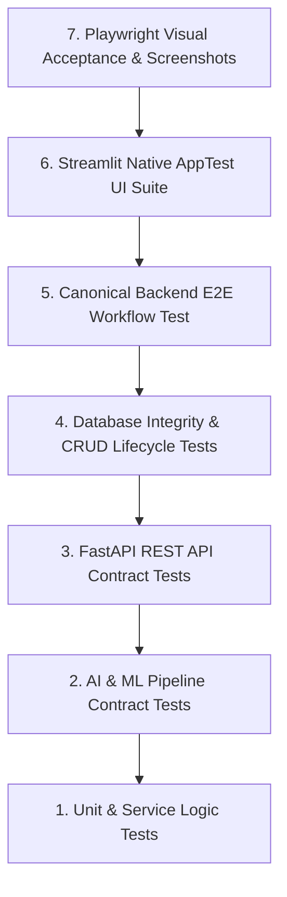

# RailHelpAI — Comprehensive Testing Pyramid & Quality Specification

> **Document Type:** Quality Assurance & Testing Architecture Specification
> **Status:** Active & Automated in GitHub Actions CI

---

## 📌 The 7-Layer Testing Pyramid

RailHelpAI employs a 7-layer testing pyramid to ensure system reliability across backend logic, ML models, REST APIs, database persistence, and frontend UI workstations.



---

## 🧪 Testing Layer Breakdown

| Layer | Focus / Scope | Primary Target Modules | Runner / Tool |
| :--- | :--- | :--- | :--- |
| **1. Unit Tests** | Preprocessor, sentiment, SLA, workflow | `app/ai/preprocessor.py`, `app/services/` | `pytest` |
| **2. AI Pipeline Contracts**| Category ML, NER entity extraction, priority, router | `app/ai/classifier.py`, `app/ai/pipeline.py` | `pytest` |
| **3. API Contract Tests** | OpenAPI request/response schema validation | `app/backend/api/` | `pytest` + `TestClient` |
| **4. Database Integrity** | SQLite ORM, foreign keys, transaction rollback | `app/database/models.py`, `connection.py` | `pytest` + SQLite memory |
| **5. Backend E2E Workflow**| Canonical demo grievance end-to-end pipeline | `app/main.py`, `app/backend/api/` | `pytest` |
| **6. Streamlit AppTest** | Headless UI widget, session state, layout tests | `app/frontend/app.py`, `pages/` | `pytest` + `AppTest` |
| **7. Browser Audit** | Real Chromium visual QA & screenshot capture | `http://127.0.0.1:8501` | Playwright Python |

---

## ⚙️ Execution Commands

```powershell
# 1. Run Python Bytecode Compile Check
.\venv\Scripts\python.exe -m compileall app

# 2. Run Page Import Smoke Tests
.\venv\Scripts\python.exe scripts/test_page_imports.py

# 3. Run Complete Automated Pytest Suite (Layers 1-6)
.\venv\Scripts\python.exe -m pytest tests/ -v

# 4. Run Playwright Browser Audit & Screenshot Capture (Layer 7)
.\venv\Scripts\python.exe scripts/capture_screenshots.py

# 5. Check Git Whitespace Compliance
git diff --check
```
